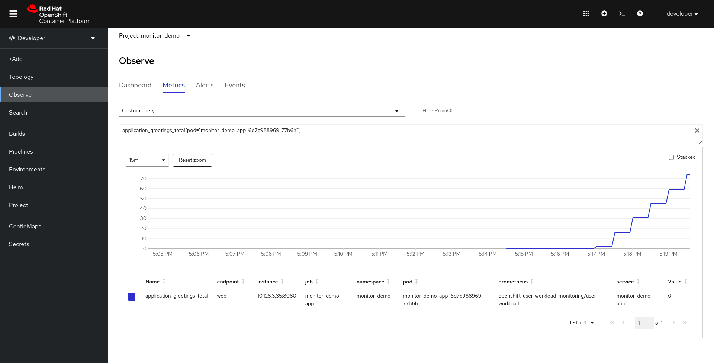

# Enabling Monitoring and Scaling of Your Own Services/Application, Creating Alert Rules, and Sending to External Systems


*By Robert Baumgartner, Red Hat Austria, May 2025 (OpenShift 4.18)*

In this blog, I will guide you on

- How do you enable application performance monitoring (APM)?

- How do you scale a user application based on application metrics with a Horizontal Pod Autoscaler (HPA)?

- How do you create an alert based on application metrics and send this alert to an external system?

For the monitoring, I will use the OpenShift Monitoring with a new feature for monitoring your own services User Workload Monitoring

You can use OpenShift Monitoring for your own services in addition to monitoring the cluster. This way, you do not need to use an additional monitoring solution. This helps keep monitoring centralized. Additionally, you can extend the access to the metrics of your services beyond cluster administrators. This enables developers and arbitrary users to access these metrics.

News:
- The developer can scale the application by using the *Custom Metrics Autoscaler Operator*, based on Kubernetes-based Event Driven Autoscaler (KEDA). It was released with OpernShift 4.12.
- The developer can create alerts and forward these alerts to an external system.

See [Configuring user workload monitoring](https://docs.redhat.com/en/documentation/openshift_container_platform/4.18/html/monitoring/configuring-user-workload-monitoring)

An older version of this document is available, but some features are no longer available. See [(old!) Enabling Monitoring and Scaling of Your Own Services/Application, Creating Alert Rules and Sending to External Systems](application-monitoring-old.md).

## Enabling Monitoring of Your Own Services in OpenShift

This is done by an update on the configmap within the project openshift-monitoring.

Make sure you are logged in as cluster-admin:

```shell
$ cat <<EOF | oc apply -f -
apiVersion: v1
kind: ConfigMap
metadata:
  name: cluster-monitoring-config
  namespace: openshift-monitoring
data:
  config.yaml: |
    enableUserWorkload: true
    alertmanagerMain:
      enableUserAlertmanagerConfig: true     
EOF
```

As a cluster administrator, you can enable alert routing for user-defined projects. With this feature, you can allow users with the *alert-routing-edit* cluster role to configure alert notification routing and receivers for user-defined projects. These notifications are routed by the optional Alertmanager instance dedicated to user-defined monitoring.

## Check User Workload Monitoring

After a short time, you can check that the prometheus-user-workload pods were created and running:

```shell
$ oc get pod -n openshift-user-workload-monitoring
NAME                                   READY   STATUS    RESTARTS   AGE
alertmanager-user-workload-0           6/6     Running   0          5d1h
alertmanager-user-workload-1           6/6     Running   0          5d1h
prometheus-operator-744ff78877-k2ng5   2/2     Running   0          5d21h
prometheus-user-workload-0             6/6     Running   0          5d21h
prometheus-user-workload-1             6/6     Running   2          5d21h
thanos-ruler-user-workload-0           4/4     Running   0          5d21h
thanos-ruler-user-workload-1           4/4     Running   0          5d21h
```

## Install the Custom Metrics Autoscaler Operator

- In the OpenShift Container Platform web console, click **Operators →  OperatorHub**.
- Choose **Custom Metrics Autoscaler** from the list of available Operators, and click **Install**.
- On the Install Operator page, ensure that the **All namespaces on the cluster (default)** option is selected for **Installation Mode**. This installs the Operator in all namespaces.
- Ensure that the **openshift-keda** namespace is selected for **Installed Namespace**. OpenShift Container Platform creates the namespace, if not present in your cluster.
- Click **Install**.
- Verify the installation

```shell
$ oc get all -n openshift-keda
Warning: apps.openshift.io/v1 DeploymentConfig is deprecated in v4.14+, unavailable in v4.10000+
Warning: kubevirt.io/v1 VirtualMachineInstancePresets is now deprecated and will be removed in v2.
NAME                                                     READY   STATUS    RESTARTS   AGE
pod/custom-metrics-autoscaler-operator-54db496b7-cww25   1/1     Running   0          5d9h
NAME                                                 READY   UP-TO-DATE   AVAILABLE   AGE
deployment.apps/custom-metrics-autoscaler-operator   1/1     1            1           5d9h
NAME                                                           DESIRED   CURRENT   READY   AGE
replicaset.apps/custom-metrics-autoscaler-operator-54db496b7   1         1         1       5d9h
```

See [Installing the custom metrics autoscaler](https://docs.redhat.com/en/documentation/openshift_container_platform/4.18/html/nodes/automatically-scaling-pods-with-the-custom-metrics-autoscaler-operator#nodes-cma-autoscaling-custom-install_nodes-cma-autoscaling-custom-install)

## Install the KedaController custom resource, which creates the required CRD

```shell
$ cat <<EOF | oc apply -f -
apiVersion: keda.sh/v1alpha1
kind: KedaController
metadata:
  name: keda
  namespace: openshift-keda
spec:
  admissionWebhooks:
    logEncoder: console
    logLevel: info
  metricsServer:
    logLevel: "0"
  operator:
    logEncoder: console
    logLevel: info
  watchNamespace: ""
```

**watchNamespaces** specifies a single namespace in which the Custom Metrics Autoscaler Operator should scale applications. Leave it blank or leave it empty to scale applications in all namespaces. 

## Understanding custom metrics autoscaler triggers 

Triggers, also known as scalers, provide the metrics that the Custom Metrics Autoscaler Operator uses to scale your pods.

The custom metrics autoscaler currently supports the Prometheus, CPU, memory, Apache Kafka, and cron triggers.

You use a *ScaledObject* or *ScaledJob* custom resource to configure triggers for specific objects.

- Prometheus trigger: You can scale pods based on Prometheus metrics, which can use the installed OpenShift Container Platform monitoring or an external Prometheus server as the metrics source. 
- CPU trigger: You can scale pods based on CPU metrics. This trigger uses cluster metrics as the source for metrics.
- Memory trigger:You can scale pods based on memory metrics. This trigger uses cluster metrics as the source for metrics.

## Create a New Project

Create a new project (for example monitor-demo) and give a normal user (such as developer) admin rights onto the project. Add the newly created role (monitoring-edit) to the user:

```shell
$ oc new-project monitor-demo
You can add applications to this project with the 'new-app' command. For example, try:

    oc new-app django-psql-example

to build a new example application in Python. Or use kubectl to deploy a simple Kubernetes application:

    kubectl create deployment hello-node --image=k8s.gcr.io/serve_hostname

$ oc policy add-role-to-user admin developer -n monitor-demo 
clusterrole.rbac.authorization.k8s.io/admin added: "developer"
$ oc policy add-role-to-user monitoring-edit developer -n monitor-demo 
clusterrole.rbac.authorization.k8s.io/monitoring-edit added: "developer"
$ oc policy add-role-to-user alert-routing-edit developer -n monitor-demo
clusterrole.rbac.authorization.k8s.io/alert-routing-edit added: "developer"
```

The role *alert-routing-edit* is only required if the user should be able to configure alert notification routing and receivers for user-defined projects.

## Login as the Normal User

```shell
$ oc login -u developer
Authentication required for https://api.rbaumgar.demo.net:6443 (openshift)
Username: developer
Password: 
Login successful.

You have one project on this server: "monitor-demo"

Using project "monitor-demo".
```

## Sample Application

### Deploy a Sample Application

All modern application development frameworks (like Quarkus) support out-of-the-box metrics features, like Eclipse Microprofile support in Quarkus, [Quarkus - MicroProfile Metrics](https://quarkus.io/guides/microprofile-metrics).

To simplify this document, I am using an existing example. The application is based on an example at [GitHub - rbaumgar/monitor-demo-app: Quarkus demo app to show Application Performance Monitoring (APM)](https://github.com/rbaumgar/monitor-demo-app). 

Deploying a sample application monitor-demo-app and exposes a route:

```shell
$ cat <<EOF |oc apply -f -
apiVersion: apps/v1
kind: Deployment
metadata:
  labels:
    app: monitor-demo-app
  name: monitor-demo-app
spec:
  replicas: 1
  selector:
    matchLabels:
      app: monitor-demo-app
  template:
    metadata:
      labels:
        app: monitor-demo-app
    spec:
      containers:
      - image: quay.io/rbaumgar/monitor-demo-app-jvm
        imagePullPolicy: IfNotPresent
        name: monitor-demo-app
---
apiVersion: v1
kind: Service
metadata:
  labels:
    app: monitor-demo-app
  name: monitor-demo-app
spec:
  ports:
  - port: 8080
    protocol: TCP
    targetPort: 8080
    name: web
  selector:
    app: monitor-demo-app
  type: ClusterIP
---
apiVersion: route.openshift.io/v1
kind: Route
metadata:
  labels:
    app: monitor-demo-app
  name: monitor-demo-app
spec:
  path: /
  to:
    kind: Service
    name: monitor-demo-app
  port:
    targetPort: web
EOF
deployment.apps/monitor-demo-app created
service/monitor-demo-app created
route.route.openshift.io/monitor-demo-app exposed
```

If you want to use the Quarkus native image, change the image name in the deployment to *monitor-demo-app-native*.

:star: It is very important that you define labels at the Deployment and Service. Those will be referenced later!

### Test Sample Application

Check the router URL with */hello* and see the hello message with the pod name. Do this multiple times.

```shell
$ export URL=$(oc get route monitor-demo-app -o jsonpath='{.spec.host}')
$ curl $URL/hello
hello from monitor-demo-app monitor-demo-app-78fc685c94-mtm28
$ curl $URL/hello
hello from monitor-demo-app monitor-demo-app-78fc685c94-mtm28
...
```

### Check Available Metrics

See all available metrics */q/metrics* and only application specific metrics */q/metrics/application*:

```shell
$ curl $URL/q/metrics/application
# HELP application_greetings_total How many greetings we've given.
# TYPE application_greetings_total counter
application_greetings_total 3.0
# HELP application_greetings_2xx_total How many 2xx we've given.
# TYPE application_greetings_2xx_total counter
application_greetings_2xx_total 0.0
# HELP application_greetings_5xx_total How many 5xx we've given.
# TYPE application_greetings_5xx_total counter
application_greetings_5xx_total 0.0
# TYPE application_org_example_rbaumgar_PrimeNumberChecker_checksTimer_rate_per_second gauge
application_org_example_rbaumgar_PrimeNumberChecker_checksTimer_rate_per_second 0.0
# TYPE application_org_example_rbaumgar_PrimeNumberChecker_checksTimer_one_min_rate_per_second gauge
...
```

 With *application_greetings_total*, you will see how often you have called the */hello* URL. Later, we will use this metric.

## Setting up Metrics Collection

To use the metrics exposed by your service, you need to configure OpenShift Monitoring to scrape metrics from the */q/metrics* endpoint. You can do this using a ServiceMonitor, a custom resource definition (CRD) that specifies how a service should be monitored, or a PodMonitor, a CRD that specifies how a pod should be monitored. The former requires a Service object, while the latter does not, allowing Prometheus to directly scrape metrics from the metrics endpoint exposed by a pod.

```shell
$ cat <<EOF | oc apply -f -
apiVersion: monitoring.coreos.com/v1
kind: ServiceMonitor
metadata:
  labels:
    k8s-app: monitor-demo-monitor
  name: monitor-demo-monitor
spec:
  endpoints:
  - interval: 30s
    port: web
    scheme: http
    path: /q/metrics
  selector:
    matchLabels:
      app: monitor-demo-app
EOF
servicemonitor.monitoring.coreos.com/monitor-demo-monitor created
$ oc get servicemonitor
NAME                   AGE
monitor-demo-monitor   42s
```

:star: For a Quarkus application, the default path for metrics is */q/metrics*, so you have to specify it!

If you are not able to create the *ServiceMonitor*, you do not have the role *montitoring-rules-edit*.

:star: The *matchLabels* must be the same as you defined at the Deployment and Service!

## Accessing the Metrics of Your Service

Once you have enabled the monitoring of your own services, deployed a service, and set up metrics collection for it, you can access the metrics of the service as a cluster administrator, as a developer, or as a user with view permissions for the project.

1. Access the Prometheus web interface:
   
   - To access the metrics as a cluster administrator, go to the OpenShift Container Platform web console, switch to the Administrator Perspective, and click **Observer → Metrics** (OpenShift 4.8+).
     
     :star: Cluster administrators, when using the Administrator Perspective, have access to all cluster metrics and to custom service metrics from all projects.
     
     :star: Only cluster administrators have access to the Alertmanager and Prometheus UIs.
   
   - To access the metrics as a developer or a user with permissions, go to the OpenShift Container Platform web console, switch to the Developer Perspective, then click **Observer → Metrics**.
     
     :star: Developers can only use the Developer Perspective. They can only query metrics from a single project.

2. Use the PromQL interface to run queries for your services.

Here is an example:



You can generate load onto your application, and so you will see more on the graph.

```shell
$ for i in {1..1000}; do curl $URL/hello; sleep 10; done
```

PromQL Example: If you want to see the number of requests per second (rated in two minutes) on the sample service, you can use the following query:

> sum(rate(application_greetings_total{namespace="monitor-demo"}[2m]))

You can also use the **Thanos Querier** to display the application metrics. The Thanos Querier enables aggregating and, optionally, deduplicating cluster and user workload metrics under a single, multi-tenant interface.

Thanos Querier can be reached at: https://thanos-querier-openshift-monitoring.apps.your.cluster/graph

If you are just interested in exposing application metrics to the dashboard, you can stop here.

## Exposing Custom Application Metrics for Auto-Scaling

!!! You can export application metrics for the Horizontal Pod Autoscaler (HPA).

Prometheus Adapter is a Technology Preview feature only. See [Exposing custom application metrics for autoscaling | Monitoring](https://docs.openshift.com/container-platform/4.6/monitoring/exposing-custom-application-metrics-for-autoscaling.html).

### Create Service Account

Create a new service account for your Prometheus Adapter in the user namespace (for example, monitor-demo):

```shell
$ cat <<EOF | oc apply -f -
apiVersion: v1
kind: Secret
metadata:
  name: thanos-token
  annotations:
    kubernetes.io/service-account.name: thanos
type: kubernetes.io/service-account-token
EOF
serviceaccount/thanos-token created
```

### Create the Required Cluster Roles

```shell
$ cat <<EOF | oc apply -f -
apiVersion: rbac.authorization.k8s.io/v1
kind: Role
metadata:
  name: thanos-metrics-reader
rules:
- apiGroups:
  - ""
  resources:
  - pods
  verbs:
  - get
- apiGroups:
  - metrics.k8s.io
  resources:
  - pods
  - nodes
  verbs:
  - get
  - list
  - watch
EOF
role.rbac.authorization.k8s.io/thanos-metrics-reader created
```

Add the newly created role bindings for the service account:

```shell
$ cat <<EOF | oc apply -f -
apiVersion: rbac.authorization.k8s.io/v1
kind: RoleBinding
metadata:
  name: thanos-metrics-reader
roleRef:
  apiGroup: rbac.authorization.k8s.io
  kind: Role
  name: thanos-metrics-reader
subjects:
- kind: ServiceAccount
  name: thanos
  namespace: monitor-demo
EOF
rolebinding.rbac.authorization.k8s.io/thanos-metrics-reader created
```

## Create the Prometheus trigger 


```shell
$ cat <<EOF | oc apply -f -
apiVersion: keda.sh/v1alpha1
kind: ScaledObject
metadata:
  name: monitor-so
spec:
  minReplicaCount: 1
  scaleTargetRef:
    name: monitor-demo-app
    kind: Deployment
  triggers:
  - type: prometheus
    authenticationRef:
      name: keda-trigger-auth-prometheus
    metadata:
      authModes: bearer
      ignoreNullValues: "false"
      metricName: my_http_requests
      namespace: monitor-demo
      query: sum(rate(application_greetings_total{job="monitor-demo-app"}[1m]))
      serverAddress: https://thanos-querier.openshift-monitoring.svc.cluster.local:9092
      threshold: "1"
      unsafeSsl: "false"
    type: prometheus
EOF

:star: If you are using a different namespace, please don't forget to replace the namespace (monitor-demo). And when you want to scale a different deployment object, you have to change the *name* in the *scaleTargetRef*.

Check the scaledojects and automatically created the Horizontal Pod Autoscaling/hpa

```shell
$ oc get scaledobjects 
NAME         SCALETARGETKIND      SCALETARGETNAME    MIN   MAX   TRIGGERS     AUTHENTICATION                 READY   ACTIVE   FALLBACK   PAUSED    AGE
monitor-so   apps/v1.Deployment   monitor-demo-app   1     5     prometheus   keda-trigger-auth-prometheus   True    False    False      Unknown   152m
$ oc get hpa
NAME                  REFERENCE                     TARGETS     MINPODS   MAXPODS   REPLICAS   AGE
keda-hpa-monitor-so   Deployment/monitor-demo-app   0/1 (avg)   1         5         1          153m
```

Now it is time to do the final test!

Run the load generator on one screen. Something like:

```shell
$ for i in {1..1000}; do curl $URL/hello >/dev/null 2>&1; sleep .10; done
```

On another screen, we will check the number of pods:

```shell
$ for i in {1..20}; do oc get pod -l app=monitor-demo-app; sleep 30; done
NAME                               READY   STATUS    RESTARTS   AGE
monitor-demo-app-fd65c7894-krjsp   1/1     Running   3          6d1h
NAME                               READY   STATUS    RESTARTS   AGE
monitor-demo-app-fd65c7894-krjsp   1/1     Running   3          6d1h
NAME                               READY   STATUS    RESTARTS   AGE
monitor-demo-app-fd65c7894-667gg   1/1     Running   0          17s
monitor-demo-app-fd65c7894-f8fps   1/1     Running   0          17s
monitor-demo-app-fd65c7894-krjsp   1/1     Running   3          6d1h
NAME                               READY   STATUS    RESTARTS   AGE
monitor-demo-app-fd65c7894-5lxd9   1/1     Running   0          18s
monitor-demo-app-fd65c7894-667gg   1/1     Running   0          48s
monitor-demo-app-fd65c7894-f8fps   1/1     Running   0          48s
monitor-demo-app-fd65c7894-krjsp   1/1     Running   3          6d1h
...
```

We see that the number of pods is increasing automatically.

We can also check the HPA. 

Under *TARGETS* we see the actual value of *my_http_requests*:

```shell
$ for i in {1..12}; do oc get hpa; sleep 30; done
NAME              REFERENCE                     TARGETS   MINPODS   MAXPODS   REPLICAS   AGE
monior-demo-hpa   Deployment/monitor-demo-app   0/1       1         4         1          56s
NAME              REFERENCE                     TARGETS   MINPODS   MAXPODS   REPLICAS   AGE
monior-demo-hpa   Deployment/monitor-demo-app   955m/1    1         4         1          86s
NAME              REFERENCE                     TARGETS   MINPODS   MAXPODS   REPLICAS   AGE
monior-demo-hpa   Deployment/monitor-demo-app   2433m/1   1         4         3          116s
NAME              REFERENCE                     TARGETS   MINPODS   MAXPODS   REPLICAS   AGE
monior-demo-hpa   Deployment/monitor-demo-app   3633m/1   1         4         4          2m27s
...
NAME              REFERENCE                     TARGETS   MINPODS   MAXPODS   REPLICAS   AGE
monior-demo-hpa   Deployment/monitor-demo-app   0/1       1         4         3          10m
NAME              REFERENCE                     TARGETS   MINPODS   MAXPODS   REPLICAS   AGE
monior-demo-hpa   Deployment/monitor-demo-app   0/1       1         4         1          11m
```

Perfect! Everything works as expected!

Congratulations!

Oh, one more thing ...

### Scale Down

If scaling down takes longer than expected, this Kubernetes documentation explains why

**Configure Cooldown Period**

The dynamic nature of the metrics being evaluated by the HPA may at times, lead to scaling events in quick succession without a period between those scaling events. This leads to [thrashing](https://kubernetes.io/docs/tasks/run-application/horizontal-pod-autoscale/#support-for-cooldown-delay), where the number of replicas fluctuates frequently and is not desirable.

To get around this and specify a cool down period, a best practice is to configure the *--horizontal-pod-autoscaler-downscale-stabilization* flag passed to the kube-controller-manager. This flag has a default value of five minutes and specifies the duration HPA waits after a downscale event before initiating another downscale operation.

## Alert Rules

### Create Alert Rule

```shell
$ cat <<EOF | oc apply -f -
apiVersion: monitoring.coreos.com/v1
kind: PrometheusRule
metadata:
  name: example-500-alert
  labels:
    openshift.io/prometheus-rule-evaluation-scope: leaf-prometheus
spec:
  groups:
    - name: example
      rules:
        - alert: Error500Alert
          description: The demo application has received more than two "/hello/5xx" within one minute
          message: 5xx received
          summary: more 2 5xx requests where received within 1 minute
          expr: increase(application_greetings_5xx_total{job="monitor-demo-app"}[1m]) > 2
EOF
prometheusrules.monitoring.coreos.com/example-500-alert created
```

This configuration creates an alerting rule named example-500-alert. The alerting rule fires an alert when the counter of 5xx requests increases by more the 2 in one minute.

If that label (leaf-prometheus) is present, the alerting rule is deployed on the Prometheus instance in the openshift-user-workload-monitoring project. If the label is not present, the alerting rule is deployed to Thanos Ruler.

The cluster-admin can view all alert rules in the Administrator perspective, navigate to **Monitoring → Alerting → Alerting Rules**.

The user can view the rules of one project in the Developer perspective, navigate to **Observe → Alerts** in the OpenShift Container Platform web console.

## Sending Alerts to External Systems

In OpenShift Container Platform, firing alerts can be viewed in the Alerting UI. Alerts are not configured by default to be sent to any notification systems. You can configure OpenShift Container Platform to send alerts to the following receiver types:

- PagerDuty
- Webhook
- Email
- Slack

In this demo, we will send the alert to our sample application (webhook).

### Configuring alert receivers

You can configure the alert receivers as a developer.

```shell
$ cat <<EOF | oc apply -f -
apiVersion: monitoring.coreos.com/v1beta1
kind: AlertmanagerConfig
metadata:
  name: example-routing
spec:
  route:
    groupBy: ['alertname']
    groupWait: 30s
    groupInterval: 1m
    repeatInterval: 2m  
    receiver: monitor-app
  receivers:
  - name: monitor-app
    webhookConfigs:
    - url: http://monitor-demo-app-monitor-demo.apps.ocp4.openshift.freeddns.org/hello/alert-hook
EOF
alertmanagerconfig.monitoring.coreos.com/example-routing created
```

More Details [ Managing alerts as a Developer](https://docs.redhat.com/en/documentation/openshift_container_platform/4.18/html/monitoring/managing-alerts#managing-alerts-as-a-developer)

### Test Alert

Call the 5xx URL of the demo application twice and check the log of the demo application.

```shell
$ export URL=$(oc get route monitor-demo-app -o jsonpath='{.spec.host}')
$ curl $URL/hello/5xx
Got 5xx Response
$ curl $URL/hello/5xx
Got 5xx Response
$ oc logs deployment/monitor-demo-app -f
...
2025-04-25 11:00:16,187 INFO  [org.exa.rba.GreetingResource] (executor-thread-3) 5xx received
2025-04-25 11:00:16,956 INFO  [org.exa.rba.GreetingResource] (executor-thread-3) 5xx received
2025-04-25 11:00:17,777 INFO  [org.exa.rba.GreetingResource] (executor-thread-3) 5xx received
2025-04-25 11:00:18,633 INFO  [org.exa.rba.GreetingResource] (executor-thread-3) 5xx received
2025-04-25 11:00:19,886 INFO  [org.exa.rba.GreetingResource] (executor-thread-3) 5xx received
2025-04-25 11:00:35,600 INFO  [org.exa.rba.GreetingResource] (executor-thread-3) Alert received: 
{
  "receiver": "monitor-demo/example-routing/monitor-app",
  "status": "firing",
  "alerts": [
    {
      "status": "firing",
      "labels": {
        "alertname": "Error500Alert",
        "endpoint": "web",
        "instance": "10.130.0.80:8080",
        "job": "monitor-demo-app",
        "namespace": "monitor-demo",
        "pod": "monitor-demo-app-67f655bf68-r7trc",
        "prometheus": "openshift-user-workload-monitoring/user-workload",
        "service": "monitor-demo-app"
      },
      "annotations": {},
      "startsAt": "2025-04-25T11:00:35.042Z",
      "endsAt": "0001-01-01T00:00:00Z",
      "generatorURL": "https://console-openshift-console.apps.ocp4.openshift.freeddns.org/monitoring/graph?g0.expr=increase%28application_greetings_5xx_total%7Bjob%3D%22monitor-demo-app%22%2Cnamespace%3D%22monitor-demo%22%7D%5B1m%5D%29+%3E+2&g0.tab=1",
      "fingerprint": "483eb0cd5dcb2110"
    }
  ],
  "groupLabels": {
    "alertname": "Error500Alert"
  },
  "commonLabels": {
    "alertname": "Error500Alert",
    "endpoint": "web",
    "instance": "10.130.0.80:8080",
    "job": "monitor-demo-app",
    "namespace": "monitor-demo",
    "pod": "monitor-demo-app-67f655bf68-r7trc",
    "prometheus": "openshift-user-workload-monitoring/user-workload",
    "service": "monitor-demo-app"
  },
  "commonAnnotations": {},
  "externalURL": "https://console-openshift-console.apps.ocp4.openshift.freeddns.org/monitoring",
  "version": "4",
  "groupKey": "{}/{namespace=\"monitor-demo\"}:{alertname=\"Error500Alert\"}",
  "truncatedAlerts": 0
}

2025-04-25 11:01:35,071 INFO  [org.exa.rba.GreetingResource] (executor-thread-3) Alert received: 
{
  "receiver": "monitor-demo/example-routing/monitor-app",
  "status": "resolved",
  "alerts": [
    {
      "status": "resolved",
      "labels": {
        "alertname": "Error500Alert",
        "endpoint": "web",
        "instance": "10.130.0.80:8080",
        "job": "monitor-demo-app",
        "namespace": "monitor-demo",
        "pod": "monitor-demo-app-67f655bf68-r7trc",
        "prometheus": "openshift-user-workload-monitoring/user-workload",
        "service": "monitor-demo-app"
      },
      "annotations": {},
      "startsAt": "2025-04-25T11:00:35.042Z",
      "endsAt": "2025-04-25T11:01:05.042Z",
      "generatorURL": "https://console-openshift-console.apps.ocp4.openshift.freeddns.org/monitoring/graph?g0.expr=increase%28application_greetings_5xx_total%7Bjob%3D%22monitor-demo-app%22%2Cnamespace%3D%22monitor-demo%22%7D%5B1m%5D%29+%3E+2&g0.tab=1",
      "fingerprint": "483eb0cd5dcb2110"
    }
  ],
  "groupLabels": {
    "alertname": "Error500Alert"
  },
  "commonLabels": {
    "alertname": "Error500Alert",
    "endpoint": "web",
    "instance": "10.130.0.80:8080",
    "job": "monitor-demo-app",
    "namespace": "monitor-demo",
    "pod": "monitor-demo-app-67f655bf68-r7trc",
    "prometheus": "openshift-user-workload-monitoring/user-workload",
    "service": "monitor-demo-app"
  },
  "commonAnnotations": {},
  "externalURL": "https://console-openshift-console.apps.ocp4.openshift.freeddns.org/monitoring",
  "version": "4",
  "groupKey": "{}/{namespace=\"monitor-demo\"}:{alertname=\"Error500Alert\"}",
  "truncatedAlerts": 0
}
```

You will find in the application log two alters received. One when the alert is fired (status:firing) an one minute later when the alert is resolved (status:resolved).

Congratulation! Done!

## Remove this Demo

```shell
$ oc delete prometheusrules.monitoring.coreos.com/example-500-alert
$ oc delete deployment.apps/prometheus-adapter
$ oc delete apiservice.apiregistration.k8s.io/v1beta1.custom.metrics.k8s.io
$ oc delete clusterrolebinding.rbac.authorization.k8s.io/hpa-controller-custom-metrics
$ oc delete clusterrolebinding.rbac.authorization.k8s.io/custom-metrics-resource-reader
$ oc delete rolebinding.rbac.authorization.k8s.io/custom-metrics-auth-reader
$ oc delete clusterrolebinding.rbac.authorization.k8s.io/custom-metrics:system:auth-delegator
$ oc delete clusterrole.rbac.authorization.k8s.io/custom-metrics-resource-reader
$ oc delete clusterrole.rbac.authorization.k8s.io/custom-metrics-server-resources
$ oc delete servicemonitor.monitoring.coreos.com/monitor-demo-monitor 
$ oc delete ClusterRole/monitor-crd-edit
$ oc edit configmap/cluster-monitoring-config -n openshift-monitoring
$ oc get pod -n openshift-user-workload-monitoring
$ oc delete project monitor-demo
```

The alter receiver has to be removed from the OpenShift web console!

This document: 

**[Github: rbaumgar/monitor-demo-app](https://github.com/rbaumgar/monitor-demo-app/blob/master/application-monitoring.md)**
