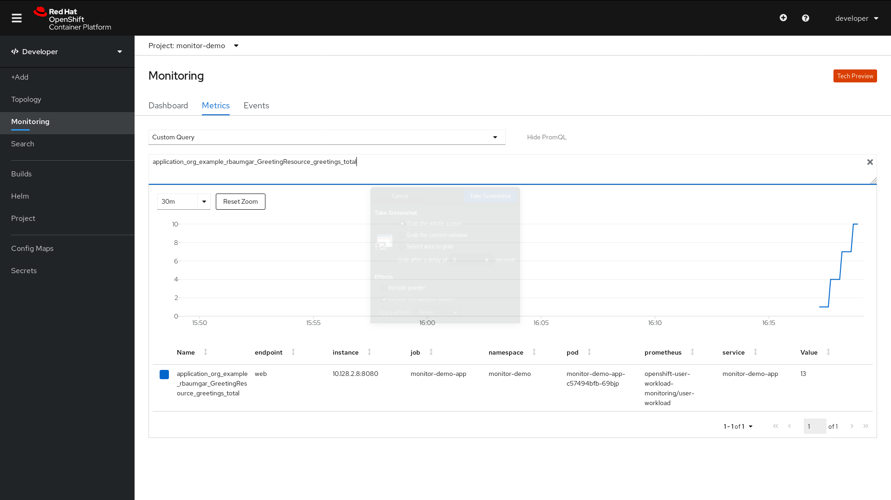

# Enabling Monitoring and Scaling of Your Own Services/Application

*By Robert Baumgartner, Red Hat Austria, April 2020 (OpenShift 4.3), update July 2020 (OpenShift 4.5)*

In this blog I will guide you on

- How to enable an application performance monitoring (APM).

- How to scale a user application based on application metrics with a Horizontal Pod Aotoscaler (HPA).

For the monitoring, I will use the OpenShift Monitoring with a new feature for monitoring your own services.

You can use OpenShift Monitoring for your own services in addition to monitoring the cluster. This way, you do not need to use an additional monitoring solution. This helps keep monitoring centralized. Additionally, you can extend the access to the metrics of your services beyond cluster administrators. This enables developers and arbitrary users to access these metrics.

This is based on OpenShift 4.5, which at this time is a Technical Preview. See [Monitoring your own services | Monitoring | OpenShift Container Platform 4.5](https://docs.openshift.com/container-platform/4.5/monitoring/monitoring-your-own-services.html).

## Enabling Monitoring of Your Own Services

A cluster administrator has to enable the User Workload Monitoring once. 

As of OpenShift 4.5, this is done by an update on the configmap within the project openshift-monitoring.

Make sure you are logged in as cluster-admin:

```shell
$ cat <<EOF | oc apply -f -
apiVersion: v1
kind: ConfigMap
metadata:
  name: cluster-monitoring-config
  namespace: openshift-monitoring
data:
  config.yaml: |
    techPreviewUserWorkload:
      enabled: true
EOF
```

If needed some more Prometheus parameters can be added to the configmap like the following:

```shell
...
    techPreviewUserWorkload:
      enabled: true
    prometheusUserWorkload:
      retention: 24h
      volumeClaimTemplate:
        metadata:
          name: prometheus
        spec:
          storageClassName: thin
          resources:
            requests:
              storage: 20Gi
```

After a short time, you can check that the prometheus-user-workload pods were created and running:

```shell
$ oc get pod -n openshift-user-workload-monitoring 
NAME                                   READY   STATUS    RESTARTS   AGE
prometheus-operator-7bcc9cc899-p8cbr   1/1     Running   0          10h
prometheus-user-workload-0             5/5     Running   1          10h
prometheus-user-workload-1             5/5     Running   1          10h
thanos-ruler-user-workload-0           3/3     Running   0          10h
thanos-ruler-user-workload-1           3/3     Running   0          10h
```

The thanos-ruler-user-workload pods are not available in OpenShift 4.3.

## Create Metrics Collection Role

This role is no longer needed in OpenShift 4.5! Only needed in OpenShift 4.3/4.4.

Create a new role for setting up metrics collection:

```shell
$ cat <<EOF | oc apply -f -
kind: ClusterRole
apiVersion: rbac.authorization.k8s.io/v1
metadata:
 name: monitor-crd-edit
rules:
- apiGroups: ["monitoring.coreos.com"]
  resources: ["prometheusrules", "servicemonitors", "podmonitors"]
  verbs: ["get", "list", "watch", "create", "update", "patch", "delete"]
EOF
```

## Create a New Project

Create a new project (for example monitor-demo) and give a normal user (such as developer) admin rights onto the project. Add the new created role (monitor-crd-edit) to the user:

```shell
$ oc new-project monitor-demo
You can add applications to this project with the 'new-app' command. For example, try:

    oc new-app django-psql-example

to build a new example application in Python. Or use kubectl to deploy a simple Kubernetes application:

    kubectl create deployment hello-node --image=gcr.io/hello-minikube-zero-install/hello-node
$ oc policy add-role-to-user admin developer -n monitor-demo 
clusterrole.rbac.authorization.k8s.io/admin added: "developer"
$ oc policy add-role-to-user monitoring-edit developer -n monitor-demo 
clusterrole.rbac.authorization.k8s.io/monitoring-edit added: "developer"
```

In OpenShift 4.3/4.4 the role monitor-crd-edit has to be assigned to the user developer!

## Login as the Normal User

```shell
$ oc login -u developer
Authentication required for https://api.rbaumgar.demo.net:6443 (openshift)
Username: developer
Password: 
Login successful.

You have one project on this server: "monitor-demo"

Using project "monitor-demo".
```

## Sample Application

### Deploy a Sample Application

All modern application development frameworks (like Quarkus) supports out-of-the-box metrics features, like Eclipse Microprofile support in Quarkus, [Quarkus - MicroProfile Metrics](https://quarkus.io/guides/microprofile-metrics).

To simplify this document, I am using an existing example. The application is based on an example at [GitHub - rbaumgar/monitor-demo-app: Quarkus demo app to show Application Performance Monitoring (APM)](https://github.com/rbaumgar/monitor-demo-app). 

Deploying a sample application monitor-demo-app end expose a route:

```shell
$ cat <<EOF |oc apply -f -
apiVersion: apps/v1
kind: Deployment
metadata:
  labels:
    app: monitor-demo-app
  name: monitor-demo-app
spec:
  replicas: 1
  selector:
    matchLabels:
      app: monitor-demo-app
  template:
    metadata:
      labels:
        app: monitor-demo-app
    spec:
      containers:
      - image: quay.io/rbaumgar/monitor-demo-app-jvm
        imagePullPolicy: IfNotPresent
        name: monitor-demo-app
---
apiVersion: v1
kind: Service
metadata:
  labels:
    app: monitor-demo-app
  name: monitor-demo-app
spec:
  ports:
  - port: 8080
    protocol: TCP
    targetPort: 8080
    name: web
  selector:
    app: monitor-demo-app
  type: ClusterIP
---
apiVersion: route.openshift.io/v1
kind: Route
metadata:
  labels:
    app: monitor-demo-app
  name: monitor-demo-app
spec:
  path: /
  to:
    kind: Service
    name: monitor-demo-app
  port:
    targetPort: web
EOF
deployment.apps/monitor-demo-app created
service/monitor-demo-app created
route.route.openshift.io/monitor-demo-app exposed
```

:star: It is very important that you define labels at the Deployment and Service. Those will  be referenced later!

### Test Sample Application

Check the router url with */hello* and see the hello message with the pod name. Do this multiple times.

```shell
$ export URL=$(oc get route monitor-demo-app -o jsonpath='{.spec.host}')
$ curl $URL/hello
hello from monitor-demo-app monitor-demo-app-78fc685c94-mtm28
$ curl $URL/hello
hello from monitor-demo-app monitor-demo-app-78fc685c94-mtm28
...
```

### Check Available Metrics

See all available metrics */metrics* and only application specific metrics */metrics/application*:

```shell
$ curl $URL/metrics/application
# HELP application_org_example_rbaumgar_GreetingResource_greetings_total How many greetings we've given.
# TYPE application_org_example_rbaumgar_GreetingResource_greetings_total counter
application_org_example_rbaumgar_GreetingResource_greetings_total 2.0
# TYPE application_org_example_rbaumgar_PrimeNumberChecker_checksTimer_rate_per_second gauge
application_org_example_rbaumgar_PrimeNumberChecker_checksTimer_rate_per_second 0.0
# TYPE application_org_example_rbaumgar_PrimeNumberChecker_checksTimer_one_min_rate_per_second gauge
...
```

 With *application_org_example_rbaumgar_GreetingResource_greetings_total*, you will see how often you have called the */hello* url. Later we will use this metric.

## Setting up Metrics Collection

To use the metrics exposed by your service, you need to configure OpenShift Monitoring to scrape metrics from the /metrics endpoint. You can do this using a ServiceMonitor, a custom resource definition (CRD) that specifies how a service should be monitored, or a PodMonitor, a CRD that specifies how a pod should be monitored. The former requires a Service object, while the latter does not, allowing Prometheus to directly scrape metrics from the metrics endpoint exposed by a pod.

```shell
$ cat <<EOF | oc apply -f -
apiVersion: monitoring.coreos.com/v1
kind: ServiceMonitor
metadata:
  labels:
    k8s-app: monitor-demo-monitor
  name: monitor-demo-monitor
spec:
  endpoints:
  - interval: 30s
    port: web
    scheme: http
  selector:
    matchLabels:
      app: monitor-demo-app
EOF
servicemonitor.monitoring.coreos.com/monitor-demo-monitor created
$ oc get servicemonitor
NAME                   AGE
monitor-demo-monitor   42s
```

If you are not able to create the *ServiceMonitor*, you do not have the role *montitor-crd-edit*.

:star: The *matchLabels* must be the same as you defined at the Deployment and Service!

## Accessing the Metrics of Your Service

Once you have enabled monitoring your own services, deployed a service, and set up metrics collection for it, you can access the metrics of the service as a cluster administrator, as a developer, or as a user with view permissions for the project.

1. Access the Prometheus web interface:
   
   - To access the metrics as a cluster administrator, go to the OpenShift Container Platform web console, switch to the Administrator Perspective, and click **Monitoring** → **Metrics**.
     
     :star: Cluster administrators, when using the Administrator Perspective, have access to all cluster metrics and to custom service metrics from all projects.
     
     :star: Only cluster administrators have access to the Alertmanager and Prometheus UIs.
   
   - To access the metrics as a developer or a user with permissions, go to the OpenShift Container Platform web console, switch to the Developer Perspective, then click **Metrics**. In OpenShift 4.3 click on 
     
     **Advanced → Metrics**.
     
     :star: Developers can only use the Developer Perspective. They can only query metrics from a single project.

2. Use the PromQL interface to run queries for your services.

Here is an example:



You can generate load onto your application, and so will see more on the graph.

```shell
$ for i in {1..1000}; do curl $URL/hello; sleep 10; done
```

PromQL Example: If you want to see the number of requests per second (rated in two minutes) on the sample service, you can use following query:

> sum(rate(application_org_example_rbaumgar_GreetingResource_greetings_total{namespace="monitor-demo"}[2m]))

```
sum(rate(application_org_example_rbaumgar_GreetingResource_greetings_total{namespace="monitor-demo"}[2m]))
```

You can also use the **Thanos Querier** to display the application metrics. The Thanos Querier enables aggregating and, optionally, deduplicating cluster and user workload metrics under a single, multi-tenant interface.

Thanos Querier can be reached at: https://thanos-querier-openshift-monitoring.apps.your.cluster/graph

If you are just interested in exposing application metrics to the dashboard, you can stop here.

## Exposing Custom Application Metrics for Auto-Scaling

You can export application metrics for the Horizontal Pod Autoscaler (HPA).

The following steps are based on OpenShift 4.3 Prometheus Adapter: 

Prometheus Adapter is a Technology Preview feature only. See [Exposing custom application metrics for autoscaling | Monitoring | OpenShift Container Platform 4.5](https://docs.openshift.com/container-platform/4.5/monitoring/exposing-custom-application-metrics-for-autoscaling.html).

### Create Service Account

Create a new service account for your Prometheus Adapter in the user namespace (for example monitor-demo):

```shell
$ cat <<EOF | oc apply -f -
kind: ServiceAccount
apiVersion: v1
metadata:
  name: custom-metrics-apiserver
EOF
serviceaccount/custom-metrics-apiserver created
```

### Create the Required Cluster Roles

Login again as cluster admin!

Add cluster role:

```shell
$ cat <<EOF | oc apply -f -
apiVersion: rbac.authorization.k8s.io/v1
kind: ClusterRole
metadata:
  name: custom-metrics-server-resources
rules:
- apiGroups:
  - custom.metrics.k8s.io
  resources: ["*"]
  verbs: ["*"]
---
apiVersion: rbac.authorization.k8s.io/v1
kind: ClusterRole
metadata:
  name: custom-metrics-resource-reader
rules:
- apiGroups:
  - ""
  resources:
  - namespaces
  - pods
  - services
  verbs:
  - get
  - list
EOF
clusterrole.rbac.authorization.k8s.io/custom-metrics-server-resources created
clusterrole.rbac.authorization.k8s.io/custom-metrics-resource-reader created
```

Add the newly created cluster-role bindings for the service account (custom-metrics-apiserver):

```shell
$ cat <<EOF | oc apply -f -
apiVersion: rbac.authorization.k8s.io/v1
kind: ClusterRoleBinding
metadata:
  name: custom-metrics:system:auth-delegator
roleRef:
  apiGroup: rbac.authorization.k8s.io
  kind: ClusterRole
  name: system:auth-delegator
subjects:
- kind: ServiceAccount
  name: custom-metrics-apiserver
  namespace: monitor-demo
---
apiVersion: rbac.authorization.k8s.io/v1
kind: RoleBinding
metadata:
  name: custom-metrics-auth-reader
  namespace: kube-system
roleRef:
  apiGroup: rbac.authorization.k8s.io
  kind: Role
  name: extension-apiserver-authentication-reader
subjects:
- kind: ServiceAccount
  name: custom-metrics-apiserver
  namespace: monitor-demo
---
apiVersion: rbac.authorization.k8s.io/v1
kind: ClusterRoleBinding
metadata:
  name: custom-metrics-resource-reader
roleRef:
  apiGroup: rbac.authorization.k8s.io
  kind: ClusterRole
  name: custom-metrics-resource-reader
subjects:
- kind: ServiceAccount
  name: custom-metrics-apiserver
  namespace: monitor-demo
---
apiVersion: rbac.authorization.k8s.io/v1
kind: ClusterRoleBinding
metadata:
  name: hpa-controller-custom-metrics
roleRef:
  apiGroup: rbac.authorization.k8s.io
  kind: ClusterRole
  name: custom-metrics-server-resources
subjects:
- kind: ServiceAccount
  name: horizontal-pod-autoscaler
  namespace: kube-system
EOF
clusterrolebinding.rbac.authorization.k8s.io/custom-metrics:system:auth-delegator created
rolebinding.rbac.authorization.k8s.io/custom-metrics-auth-reader created
clusterrolebinding.rbac.authorization.k8s.io/custom-metrics-resource-reader created
clusterrolebinding.rbac.authorization.k8s.io/hpa-controller-custom-metrics created
```

:star: If you are using a different namespace, please don't forget to replace the namespace (monitor-demo).

Clusterrole custom-metrics:system:auth-delegator was not documented in OpenShift 4.3.

### Create an APIService

Create an APIService for the custom metrics for Prometheus Adapter:

```shell
$ cat <<EOF | oc apply -f -
apiVersion: apiregistration.k8s.io/v1beta1
kind: APIService
metadata:
  name: v1beta1.custom.metrics.k8s.io
spec:
  service:
    name: prometheus-adapter
    namespace: monitor-demo
  group: custom.metrics.k8s.io
  version: v1beta1
  insecureSkipTLSVerify: true
  groupPriorityMinimum: 100
  versionPriority: 100
EOF
apiservice.apiregistration.k8s.io/v1beta1.custom.metrics.k8s.io created
```

:star: If you are using a different namespace, please don't forget to replace the namespace (monitor-demo).

## Prometheus Adapater for User Metrics

### Show the Prometheus Adapter Image

Show the Prometheus Adapter image, which is currently used by OpenShift Metering. This will be required later!

```shell
$ oc get -n openshift-monitoring deploy/prometheus-adapter -o jsonpath="{..image}"
quay.io/openshift-release-dev/ocp-v4.0-art-dev@sha256:a8e3c383b36684a28453a4f5bb65863167bbeb409b91c9c3f5f50e1d5e923dc9
```

### Login as the Normal User

Make sure you stay in the right namespace (monitor-demo)

```shell
$ oc login -u developer
Authentication required for https://api.rbaumgar.demo.net:6443 (openshift)
Username: developer
Password: 
Login successful.

You have one project on this server: "monitor-demo"

Using project "monitor-demo".
```

### Create a ConfigMap for Prometheus Adapter

Create a ConfigMap for the user metrics for Prometheus Adapter:

```shell
$ cat <<EOF | oc apply -f -
apiVersion: v1
kind: ConfigMap
metadata:
  name: adapter-config
data:
  config.yaml: |
    rules:
    - seriesQuery: 'application_org_example_rbaumgar_GreetingResource_greetings_total {namespace!="",pod!=""}' 
      resources:
        overrides:
          namespace: {resource: "namespace"}
          pod: {resource: "pod"}
          service: {resource: "service"}
      name:
        matches: "^(.*)_total"
        as: "my_http_requests" 
      metricsQuery: 'sum(rate(<<.Series>>{<<.LabelMatchers>>}[2m])) by (<<.GroupBy>>)'
EOF
configmap/adapter-config created
```

*serierQuery* is the user metric we want to use expose in our example

*my_http_requests* is the value of requests per second rated of two minutes.

## Create a Service and an APIService Prometheus Adapter

Create a Service and an APIService for the user metrics for Prometheus Adapter:

```shell
$ cat <<EOF | oc apply -f -
apiVersion: v1
kind: Service
metadata:
  annotations:
    service.alpha.openshift.io/serving-cert-secret-name: prometheus-adapter-tls
  labels:
    name: prometheus-adapter
  name: prometheus-adapter
spec:
  ports:
  - name: https
    port: 443
    targetPort: 6443
  selector:
    app: prometheus-adapter
  type: ClusterIP
EOF
service/prometheus-adapter created
```

## Create a ConfigMap

Create a ConfigMap for the prometheus-config.yaml for the Prometheus Adapter with *insecure-skip-tls-verify: true* 

```shel
$ cat <<EOF | oc apply -f -
kind: ConfigMap
apiVersion: v1
metadata:
  name: prometheus-adapter-prometheus-config
data:
  prometheus-config.yaml: |
    apiVersion: v1
    clusters:
    - cluster:
        server: https://prometheus-user-workload.openshift-user-workload-monitoring:9091
        insecure-skip-tls-verify: true
      name: prometheus-k8s
    contexts:
    - context:
        cluster: prometheus-k8s
        user: prometheus-k8s
      name: prometheus-k8s
    current-context: prometheus-k8s
    kind: Config
    preferences: {}
    users:
    - name: prometheus-k8s
      user:
        tokenFile: /var/run/secrets/kubernetes.io/serviceaccount/token
EOF
configmap/prometheus-adapter-prometheus-config created
```

## Configuration for Deploying the Prometheus Adapter

:star: Replace the image name with the correct name you got! (spec.template.spec.containers.image)

```shell
$ cat <<EOF | oc apply -f - 
apiVersion: apps/v1
kind: Deployment
metadata:
  labels:
    app: prometheus-adapter
  name: prometheus-adapter
spec:
  replicas: 1
  selector:
    matchLabels:
      app: prometheus-adapter
  template:
    metadata:
      labels:
        app: prometheus-adapter
      name: prometheus-adapter
    spec:
      serviceAccountName: custom-metrics-apiserver
      containers:
      - name: prometheus-adapter
        image: openshift-release-dev/ocp-v4.3-art-dev 
        args:
        - --prometheus-auth-config=/etc/prometheus-config/prometheus-config.yaml
        - --secure-port=6443
        - --tls-cert-file=/var/run/serving-cert/tls.crt
        - --tls-private-key-file=/var/run/serving-cert/tls.key
        - --logtostderr=true
        - --prometheus-url=https://prometheus-user-workload.openshift-user-workload-monitoring:9091
        - --metrics-relist-interval=1m
        - --v=4
        - --config=/etc/adapter/config.yaml
        ports:
        - containerPort: 6443
        volumeMounts:
        - name: volume-serving-cert
          mountPath: /var/run/serving-cert
          readOnly: true
        - name: config
          mountPath: /etc/adapter/
          readOnly: true
        - name: prometheus-adapter-prometheus-config
          mountPath: /etc/prometheus-config
        - name: tmp-vol
          mountPath: /tmp
      volumes:
      - name: volume-serving-cert
        secret:
          secretName: prometheus-adapter-tls
      - name: config
        configMap:
          name: adapter-config
      - name: prometheus-adapter-prometheus-config
        configMap:
          name: prometheus-adapter-prometheus-config
          defaultMode: 420
      - name: tmp-vol
        emptyDir: {}
EOF
deployment.apps/prometheus-adapter created
```

Check the running Prometheus Adapter:

```shell
$ oc get pod -l app=prometheus-adapter
NAME                                  READY   STATUS    RESTARTS   AGE
prometheus-adapter-7b69fd947c-6ht7p   1/1     Running   0          10h
```

Check the log of the Prometheus Adapter:

```shell
$ oc logs deployment/prometheus-adapter|more
I0417 13:23:31.213322       1 adapter.go:93] successfully using in-cluster auth
I0417 13:23:31.836631       1 secure_serving.go:116] Serving securely on [::]:6443
I0417 13:23:32.030695       1 wrap.go:47] GET /apis/custom.metrics.k8s.io/v1beta1: (467.349µs) 200 [Go-http-client/2.0 10.129.0.1:40778]
...
```

## Check Custom Metrics

Now if everything works fine, we can expose the Custom Metrics provided by the Prometheus adapter and defined in ConfigMap, which in our case is *my_http_requests*:

```shell
# per service
$ kubectl get --raw /apis/custom.metrics.k8s.io/v1beta1/namespaces/monitor-demo/services/monitor-demo-app/my_http_requests |jq
{
  "kind": "MetricValueList",
  "...

apiVersion": "custom.metrics.k8s.io/v1beta1",
  "metadata": {
    "selfLink": "/apis/custom.metrics.k8s.io/v1beta1/namespaces/monitor-demo/services/monitor-demo-app/my_http_requests"
  },
  "items": [
    {
      "describedObject": {
        "kind": "Service",
        "namespace": "monitor-demo",
        "name": "monitor-demo-app",
        "apiVersion": "/v1"
      },
      "metricName": "my_http_requests",
      "timestamp": "2020-04-17T13:31:28Z",
      "value": "4044m",
      "selector": null
    }
  ]
}

# per pod
$ kubectl get --raw /apis/custom.metrics.k8s.io/v1beta1/namespaces/monitor-demo/pods/monitor-demo-app-fd65c7894-krjsp/my_http_requests |jq
{
  "kind": "MetricValueList",
  "apiVersion": "custom.metrics.k8s.io/v1beta1",
  "metadata": {
    "selfLink": "/apis/custom.metrics.k8s.io/v1beta1/namespaces/monitor-demo/pods/monitor-demo-app-fd65c7894-krjsp/my_http_requests"
  },
  "items": [
    {
      "describedObject": {
        "kind": "Pod",
        "namespace": "monitor-demo",
        "name": "monitor-demo-app-fd65c7894-krjsp",
        "apiVersion": "/v1"
      },
      "metricName": "my_http_requests",
      "timestamp": "2020-04-17T13:27:59Z",
      "value": "1622m",
      "selector": null
    }
  ]
}

# for all pods per namespace
$ kubectl get --raw /apis/custom.metrics.k8s.io/v1beta1/namespaces/monitor-demo/pods//my_http_requests |jq
...
```

Since we have set up Prometheus Adapter to collect the user metrics, we no have *pods/my_http_requests*pods, which measures requests per second over a two minute period.

## Create Horizontal Pod Autoscaler

Now we are at the last step of the setup. Create a Horizontal Pod Autoscaler (HPA) to scale the sample application depended on the load, scaled by the user metrics *my_http_requests*. 

```shell
$ cat <<EOF | oc apply -f -
apiVersion: autoscaling/v2beta2 
kind: HorizontalPodAutoscaler
metadata:
  name: monitor-demo-hpa 
spec:
  scaleTargetRef:
    kind: Deployment
    name: monitor-demo-app
    apiVersion: apps/v1
  minReplicas: 1
  maxReplicas: 5
  metrics:
    - type: Pods
      pods:
        metric:
          name: my_http_requests
        target:
          type: AverageValue
          # target 1000 milli-requests per second = 1 req/second 
          averageValue: 1
EOF
horizontalpodautoscaler.autoscaling/monitor-demo-hpa created
```

Now it is time do the final test!

Run on one screen the load generator. Something like:

```shell
$ for i in {1..1000}; do curl $URL/hello >/dev/null 2>&1; sleep .10; done
```

On another screen, we will check the number of pods:

```shell
$ for i in {1..20}; do oc get pod -l app=monitor-demo-app; sleep 30; done
NAME                               READY   STATUS    RESTARTS   AGE
monitor-demo-app-fd65c7894-krjsp   1/1     Running   3          6d1h
NAME                               READY   STATUS    RESTARTS   AGE
monitor-demo-app-fd65c7894-krjsp   1/1     Running   3          6d1h
NAME                               READY   STATUS    RESTARTS   AGE
monitor-demo-app-fd65c7894-667gg   1/1     Running   0          17s
monitor-demo-app-fd65c7894-f8fps   1/1     Running   0          17s
monitor-demo-app-fd65c7894-krjsp   1/1     Running   3          6d1h
NAME                               READY   STATUS    RESTARTS   AGE
monitor-demo-app-fd65c7894-5lxd9   1/1     Running   0          18s
monitor-demo-app-fd65c7894-667gg   1/1     Running   0          48s
monitor-demo-app-fd65c7894-f8fps   1/1     Running   0          48s
monitor-demo-app-fd65c7894-krjsp   1/1     Running   3          6d1h
...
```

We see that the number of pods is increasing automatically.

We can also check the HPA. 

Under *TARGETS* we see the actual value of *my_http_requests*:

```shell
$ for i in {1..12}; do oc get hpa; sleep 30; done
NAME              REFERENCE                     TARGETS   MINPODS   MAXPODS   REPLICAS   AGE
monior-demo-hpa   Deployment/monitor-demo-app   0/1       1         4         1          56s
NAME              REFERENCE                     TARGETS   MINPODS   MAXPODS   REPLICAS   AGE
monior-demo-hpa   Deployment/monitor-demo-app   955m/1    1         4         1          86s
NAME              REFERENCE                     TARGETS   MINPODS   MAXPODS   REPLICAS   AGE
monior-demo-hpa   Deployment/monitor-demo-app   2433m/1   1         4         3          116s
NAME              REFERENCE                     TARGETS   MINPODS   MAXPODS   REPLICAS   AGE
monior-demo-hpa   Deployment/monitor-demo-app   3633m/1   1         4         4          2m27s
...
NAME              REFERENCE                     TARGETS   MINPODS   MAXPODS   REPLICAS   AGE
monior-demo-hpa   Deployment/monitor-demo-app   0/1       1         4         3          10m
NAME              REFERENCE                     TARGETS   MINPODS   MAXPODS   REPLICAS   AGE
monior-demo-hpa   Deployment/monitor-demo-app   0/1       1         4         1          11m
```

Perfect! Everything works as expected!

Congratulations!

Oh, one more thing ...

## Scale Down

If scale down takes longer than expected, this Kubernetes documentation explains why

**Configure Cooldown Period**

The dynamic nature of the metrics being evaluated by the HPA may at times lead to scaling events in quick succession without a period between those scaling events. This leads to [thrashing](https://kubernetes.io/docs/tasks/run-application/horizontal-pod-autoscale/#support-for-cooldown-delay) where the number of replicas fluctuates frequently and is not desirable. 

To get around this and specify a cool down period, a best practice is to configure the `--horizontal-pod-autoscaler-downscale-stabilization` flag passed to the kube-controller-manager. This flag has a default value of five minutes and specifies the duration HPA waits after a downscale event before initiating another downscale operation.

## Remove this Demo

```shell
$ oc delete deployment.apps/prometheus-adapter
$ oc delete apiservice.apiregistration.k8s.io/v1beta1.custom.metrics.k8s.io
$ oc delete clusterrolebinding.rbac.authorization.k8s.io/hpa-controller-custom-metrics
$ oc delete clusterrolebinding.rbac.authorization.k8s.io/custom-metrics-resource-reader
$ oc delete rolebinding.rbac.authorization.k8s.io/custom-metrics-auth-reader
$ oc delete clusterrolebinding.rbac.authorization.k8s.io/custom-metrics:system:auth-delegator
$ oc delete clusterrole.rbac.authorization.k8s.io/custom-metrics-resource-reader
$ oc delete clusterrole.rbac.authorization.k8s.io/custom-metrics-server-resources
$ oc delete servicemonitor.monitoring.coreos.com/monitor-demo-monitor 
$ oc delete ClusterRole/monitor-crd-edit
$ oc edit configmap/cluster-monitoring-config -n openshift-monitoring
$ oc get pod -n openshift-user-workload-monitoring
$ oc delete project monitor-demo
```

This document: 

**[monitor-demo-app/application-monitoring.md at master · rbaumgar/monitor-demo-app · GitHub](https://github.com/rbaumgar/monitor-demo-app/blob/master/application-monitoring.md)**
